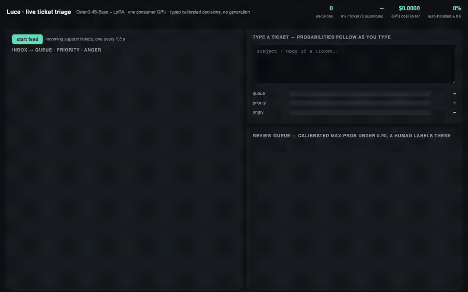
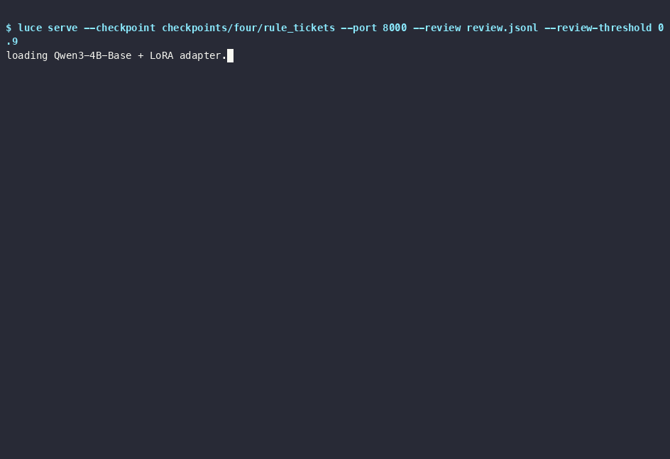

# Luce

**Describe the decision. Supply your inputs or generate them with an LLM. Luce trains a LoRA + decision head on an open model and serves decision probabilities.**

> "Almeida says Jev is trained exclusively on synthetic data" — [TechCrunch, 2026-09-18](https://techcrunch.com/2026/09/18/a-new-kind-of-ai-model-from-a-chatgpt-inventor-is-thrilling-developers/)

Luce is the open recipe for doing that with *your* task: `luce init` scaffolds the questions, `luce synth` generates inputs or annotates existing data with any OpenAI-compatible teacher, `luce train` fits a LoRA + decision head on a Qwen backbone, `luce eval` reports accuracy and calibration against *real* labels, `luce serve` answers `POST /v1/ask` with a probability per option and queues low-confidence inputs for review. No text is generated at inference.

Three question types, same as TypeSafe's Jev interface: **Choice** (one of N options), **Score** (an ordered scale), **Noul** (a statement is true or false).

**Does the sentence → data → model path actually work?** Yes: 3,000 tickets written by an LLM from a one-paragraph
description of the organisation's rules, 2 epochs of Qwen3-4B-Base on one RTX 4070 SUPER, then tested on 2,964 tickets
with rule-generated gold labels: **91.1 %** (queue 100 / anger 98.6 / priority 74.6), ECE 0.022. Jev zero-shot on the
same task: 75.1. Details in E17 below and in `EXPERIMENTS.md`.

## Demo

**[Try it in your browser](https://huggingface.co/spaces/noscienthoon/luce-live-triage)** (no GPU, replays recorded model outputs). **Live triage** — `luce serve … --review review.jsonl` also serves `/demo`: support tickets stream into an
inbox and the model answers three typed questions per ticket (queue, priority, anger) with calibrated probability bars,
per-ticket latency and running GPU cost; answers under 0.9 confidence drop into a review queue for a human; the text
box re-scores a ticket as you type. Qwen3-4B-Base + LoRA on one RTX 4070 SUPER. The recording below replays answers
and latencies the server produced on that GPU (`scripts/make_replay.py` → `luce/demo_replay.json`), so the page runs
anywhere without a GPU (`/demo?replay=1` or open `luce/demo.html?replay=1` from a static server); the live page is the
same file talking to `/v1/ask`. Recorded with `scripts/record_demo.py` (Playwright), no edits:



The same run as a terminal cast, and the training run that produced the checkpoint (3,000 LLM-written tickets,
0-step → 2 epochs → temperature fit; test on rule-generated gold 91.1 %, ECE 0.022):

<details><summary>terminal recordings</summary>




</details>

## 60-second quickstart

```bash
pip install "git+https://github.com/scienthoon/luce"        # PyPI release pending; with embedding dedup:
# pip install "luce[synth] @ git+https://github.com/scienthoon/luce"

luce init "Route customer support tickets to a queue, rate urgency, flag angry customers" \
    --examples examples.jsonl \
    --teacher "https://ai-gateway.vercel.sh/v1|openai/gpt-4o-mini"      # or OpenAI / Ollama, see below
luce synth --n 500 --dry-run                                            # prints calls, tokens, cost; no API call
luce synth --n 500                                                      # actual calls depend on votes and replenishment
luce train                                                              # mode: auto picks bi / isolated / label;
                                                                        # backbone: auto = Qwen3-4B-Base (see Backbone)
luce eval --checkpoint checkpoints/route_support_tickets --real real.jsonl
luce serve --checkpoint checkpoints/route_support_tickets --port 8000
```

```bash
curl -s localhost:8000/v1/ask -H 'content-type: application/json' -d '{
  "state": {"channel": "email", "customer_tier": "gold", "subject": "Charged twice", "body": "Two charges for one order. Fix this today."},
  "questions": {
    "queue":    {"type": "choice", "prompt": "Which support queue should handle this ticket?",
                 "options": {"billing": "Payments, refunds, duplicate charges", "shipping": "Delivery", "technical": "Bugs", "general": "Other"}},
    "priority": {"type": "score",  "prompt": "How should this ticket be prioritized?", "levels": ["Low", "Normal", "High", "Critical"]},
    "angry":    {"type": "noul",   "prompt": "The customer sounds angry."}
  }}'
```

The teacher is never defaulted: pass `--teacher "URL|MODEL"` or set `synth.teacher` in `luce.yaml`. The key comes from `LUCE_TEACHER_API_KEY`, then `OPENAI_API_KEY`, then `AI_GATEWAY_API_KEY`. Ollama needs none:

```
--teacher "https://ai-gateway.vercel.sh/v1|anthropic/claude-sonnet-5"   # Vercel AI Gateway
--teacher "https://api.openai.com/v1|gpt-5"                              # OpenAI
--teacher "http://localhost:11434/v1|qwen2.5:7b"                         # Ollama, local
```

`--writer` can point the *state* generation at a cheap or local model while labels come from a stronger teacher.

## Choose how to create your data

```bash
# Generate only named questions, with an independent record target for each.
luce synth --questions queue,angry --counts queue=500,angry=200
luce synth --types noul --n 500

# Annotate real inputs; already labeled records are retained.
luce synth --mode label --input events.jsonl --questions queue --out data/labeled

# Replace selected labels after changing a policy; retain other questions.
luce synth --mode relabel --input labeled.jsonl --questions queue --out data/revised

# Add newly generated inputs, or annotate an input file, into an existing split.
luce synth --mode append --n 100 --out data/tickets
luce synth --mode append --input new_events.jsonl --out data/tickets
```

By default, the writer gets no predetermined correct answer; Teacher labels determine the observed label distribution. Configure weighted diversity axes with `synth.grid`, optionally request training answer ratios with `synth.answer_ratios`, and use `dynamic_options: true` for candidates that vary by input. Every mode supports `--dry-run`. See [the data workflow guide](docs/SYNTH.md) for input shapes, count semantics, and balancing.

Append retains existing rows and adds every new result, including rows that match existing content. Running append again adds those results again.

## What you get, measured

Same backbone (Qwen2.5-3B) for the prompting baseline and Luce; Jev is TypeSafe's hosted model through Vercel AI Gateway. All numbers are on held-out items with temperature fitted on a validation split; ECE uses 15 bins on max-probability.

### A task with an organisational rule (900 rule-generated support tickets)

Three questions per ticket. `priority` is defined by a rule that is not in the text (template urgency + 1 if angry + 1 if the customer is gold/enterprise). 5% of labels are randomly corrupted, so no model can exceed ~95%.

| | v0 prompting (same 3B) | **Luce** (3B + 1% trained on 8,100 synthetic tickets) | Jev (hosted, zero-shot) |
|---|---|---|---|
| queue (choice, 4) | 93.0% | **95.3%** | 89.0% |
| angry (noul) | 64.3% | **95.0%** | 91.7% |
| priority (score, 4) | 34.3% | **97.3%** | 44.7% |
| ECE, all 900 | 0.105 | **0.003** | 0.107 |
| refit temperature | 0.85 | 1.21 | 2.74 |

Luce was trained on tickets from the same generator, so this row shows what training on your own task buys: the rule that prompting cannot know (priority 34 → 97) and probabilities that need no correction (ECE 0.003, at the noise floor for n=900). Jev is strong on the semantic questions and, like any zero-shot model, cannot recover the rule; its stated probabilities do not reflect that (refit T 2.74). Details: [`EXPERIMENTS.md`](EXPERIMENTS.md) E2–E3, E13; Jev raw responses in [jev-ood-calibration](https://github.com/scienthoon/jev-ood-calibration).

### Public benchmarks (what transfers to tasks Luce never trained on)

Luce here is the `isolated` mode trained on ARC-Easy + BoolQ only, evaluated on three datasets it never saw, with the training-set temperature (no refit):

| held-out | v0 prompting 3B | Luce isolated 3B | Luce label 3B | v0 prompting 7B | Jev |
|---|---|---|---|---|---|
| OpenBookQA (500) | 76.2 | 68.4 | **79.8** | 83.2 | 94.2 |
| CommonsenseQA (1,221) | 77.7 | 76.2 | **78.8** | 81.2 | 88.1 |
| HellaSwag (2,000) | 65.8 | 65.5 | 63.6 | 77.0 | 86.1 |

Accuracy transfers: on two of three unseen datasets Luce matches the prompting baseline, and the `label` mode (which starts exactly at the prompting baseline and learns a residual) beats it on two of three. **Calibration does not transfer**: Luce's refit temperature on unseen tasks is 2.5–3.3 (over-confident), and so is Jev's on the unseen ticket task above. Doubling the backbone (7B prompting) buys 3–11 points on these sets, and Jev is still 7–11 points above that; its accuracy is consistent with a much larger backbone, with these public datasets being in its training mix, or both, so treat that column as context, not as a generalisation claim. On unseen tasks, backbone size is worth more than a 1% head trained elsewhere; the head pays off in-domain (BoolQ +8 points over prompting on the same 3B). An openjev column is not included yet because we have not measured it with this harness.

**Practical rule that follows:** ship with 100–300 real labeled items. `luce eval --real` fits the temperature on them and `luce train --real` selects the checkpoint on them; without `--real`, every number Luce prints is tagged `[in-synth]` and no temperature is written to the checkpoint.

### Four real tasks, same test items for us and for Jev (E17)

Qwen3-4B-Base, 2–3 epochs on one consumer GPU (RTX 4070 SUPER 12 GB, ~40 min per task), temperature refit on a
held-out calibration split, evaluated once on a test split. Jev is TypeSafe's hosted model through Vercel AI Gateway,
zero-shot on the identical test records. Data collection scripts are in `scripts/`; details in `EXPERIMENTS.md` E17.

| task (test items) | labels used for training | Luce | Jev (0-shot) | ECE Luce / Jev |
|---|---|---|---|---|
| Phishing e-mail, noul (500; PhishNChips v5.2, the jev-phishing-bench set) | 1,000 | **97.4** | 62.6 | 0.010 / 0.154 |
| Organisational-rule tickets, 3 questions (2,964; rule-generated gold, training data written by an LLM) | 3,000 | **91.1** | 75.1 | 0.022 / 0.107 |
| GitHub issue kind, 4-way (500; kubernetes maintainer labels) | 500 | 86.9 | 84.7 | 0.044 / 0.100 |
| GitHub issue priority, 4 levels (73) | 462 | 41.1 | 37.5 | — |
| Maze risk level, 4 levels (2,640; exact probabilities) | 1,500 | **85.3** | 65.6 | 0.041 / 0.221 |
| Maze safest move, 4-way (2,640) | 1,500 | 29.2 | 41.4 | — |

What this says: where the label is a function of the input (phishing, tickets, maze risk), a few hundred to a few
thousand labels beat the zero-shot model by 20–35 points and give calibrated probabilities. Where it is not — GitHub
`kind` is already solved by the backbone (prompting alone: 83), `priority` is assigned by triage policy the text does
not contain (prompting alone: 30, majority class: 30), and the maze `safest move` needs three-step lookahead the model
does not learn from 500 mazes — training adds little or fails, and the calibrated probability shows it (priority: only
10 % of items reach 0.6 confidence). Jev is the same order of magnitude in latency (0.25 s per call on a 4070 SUPER for
us vs 0.11 s on TypeSafe's servers) and needs no training; Luce needs labels and wins where labels carry a rule.

## How it works

```
luce init   task description + seed examples ──teacher──► luce.yaml (questions, options, diversity grid)
luce synth  new: weighted grid × persona ──writer──► states ──teacher×votes──► labels
            label/relabel: supplied states + per-record candidates ──teacher×votes──► selected labels
            append: new or supplied inputs ──► additional records in the existing train/val split
luce train  Qwen backbone + LoRA r16 + decision head, soft-target CE + Brier, best checkpoint by calibrated NLL
luce eval   accuracy · NLL · Brier · ECE with noise floor · refit T · per-type and per-source · selective risk table
luce serve  POST /v1/ask → probability per option; calibrated max-prob < 0.9 → review.jsonl → luce train --append
```

`mode: auto` chooses the scorer and prints why: no training data → **label** (letters over a listed option set; step 0 equals the prompting baseline), or **isolated** if a question has more than 26 options; every question has one fixed option set → **bi** (options encoded once and cached, ~40 ms per request); options vary per input (multiple choice, candidate verification) → **isolated** (question + option in one sequence, LM-likelihood prior). Design notes and the full experiment history: [`docs/ARCHITECTURE.md`](docs/ARCHITECTURE.md), [`EXPERIMENTS.md`](EXPERIMENTS.md).

## Data format

One JSON per line, one question per line. `label_probs` gives a soft label (teacher vote fractions, distillation).

```json
{"state": {"channel": "email", "subject": "Charged twice"}, "type": "choice", "question": "Which queue?", "options": {"billing": "Payments", "shipping": "Delivery"}, "label": "billing"}
{"state": "...", "type": "score", "question": "How urgent?", "levels": ["Low", "Normal", "High"], "label": 2}
{"state": "...", "type": "noul",  "question": "The customer sounds angry.", "label": true}
```

Generated records include metadata for the grid cell, persona, teacher votes, and disagreement (`hard`); intended answers are used only when answer ratios are explicitly requested. Imported states preserve their JSON values and per-record candidates. Seed examples are used only as style references. Generated states are retained even when they repeat another generated state or a seed example. With 20 or more distinct inputs `luce init` splits examples into `seeds.jsonl` (references) and `real.jsonl` (evaluation) so the two never overlap. Public datasets: `luce convert hf --preset arc_easy|boolq|banking77|openbookqa|commonsense_qa|hellaswag|klue_ynat|nsmc`.

## Backbone

`model.backbone: auto` (the default) picks **Qwen3-4B-Base** and prints why. We measured a size ladder (E15 in
EXPERIMENTS.md: the synthetic ticket task, 0 to 2,000 labels, Qwen3 0.6B / 1.7B / 4B-Base) and the larger backbone won at
every label count:

| labels | 0.6B | 1.7B | 4B |
|---|---|---|---|
| 250 | 67.9 | 71.9 | 77.7 |
| 1,000 | 82.1 | 84.3 | **88.8** |

So a smaller backbone is a cost choice, not a free one: set `model.backbone: Qwen/Qwen3-1.7B-Base` (about 4 points on
that task, trains in a quarter of the time) or `Qwen/Qwen3-0.6B-Base` (about 7 points, runs near CPU speed) when you want
it. Custom-code backbones take `model.trust_remote_code: true` and `model.backbone_overrides: {key: value}` (used for
ByteDance/Ouro-2.6B with `total_ut_steps: 4`).

## Hardware

The default backbone, Qwen3-4B-Base, trains with LoRA and gradient checkpointing on a **12 GB card**: each of the four
tasks in E17 ran on one RTX 4070 SUPER in 20–70 minutes (peak 10.7 GB with 768-token inputs at batch 1, ~9 GB at
512 tokens and batch 2–4). On an RTX 4090 the same runs are 2–3× faster. Inference is one forward pass per option:
0.25–0.30 s for a three-question ticket on the 4070 SUPER, 8 s to load. Qwen3-1.7B-Base and 0.6B-Base fit easily
(see Backbone above for what they cost in accuracy); Qwen2.5-3B (used for E0–E13) needs a 16 GB card for the older
cross modes.

## Things to know before you build on it

- **Teacher terms of service.** Generating training data with a hosted model for internal use is generally allowed; publishing weights trained on its outputs may not be, depending on the provider. Read the terms of the teacher you name. Luce never bundles a default teacher for exactly this reason.
- **Calibration is per task.** Probabilities are honest on the distribution you trained and calibrated on. On a new task, fit the temperature on real labels before thresholding anything.
- **Synthetic validation is not validation.** `luce synth` writes a `val.jsonl` for checkpoint selection when nothing better exists; everything computed on it is printed with an `[in-synth]` tag.
- **Score questions:** targets are one-hot by default (`score_sigma: 0`). Soft neighbouring-level targets make the model honestly under-confident on argmax and drag the global temperature; use them only if you consume the expected value.

## Prior and related work

- Open Jev replicas: [TheoLeeCJ/openjev](https://github.com/TheoLeeCJ/openjev) and [AlexWortega/openjev](https://huggingface.co/AlexWortega/openjev),
  [mithalouni/system-one-open](https://github.com/mithalouni/system-one-open) (Gemma 4 E2B, 92 public datasets; its harness rebuilds the TypeSafe public eval we report on),
  [TianyuCodings/NanoJev](https://github.com/TianyuCodings/NanoJev) (0.6B, mazes), [Mapika/decider](https://github.com/Mapika/decider),
  [ikermoel/open-alternative-jev](https://github.com/ikermoel/open-alternative-jev) (so1). Luce differs in starting from a task description and a teacher rather than a fixed dataset mix, and in reporting calibration next to accuracy.
- Benchmarks we reuse: [anisselbd/jev-phishing-bench](https://github.com/anisselbd/jev-phishing-bench) (PhishNChips set),
  [C-Tianyu/NanoJev-Data](https://huggingface.co/datasets/C-Tianyu/NanoJev-Data) (mazes), [evals.typesafe.ai](https://evals.typesafe.ai) (TypeSafe public eval).
- [SamuelSacco/jev-exploration](https://github.com/SamuelSacco/jev-exploration): ledger of independent Jev measurements; ours is [jev-ood-calibration](https://github.com/scienthoon/jev-ood-calibration).
- [argilla-io/synthetic-data-generator](https://github.com/argilla-io/synthetic-data-generator) and [neulab/prompt2model](https://github.com/neulab/prompt2model): the same "describe → synthesize → train" idea for general NLP.
- TypeSafe's Jev is the reference product: [typesafe.ai](https://typesafe.ai). "Jev" and "System One" are their names; Luce uses them only descriptively.

## Repository layout

- `luce/` the package: `config.py` (luce.yaml, mode/backbone decisions), `scaffold.py` (`luce init`), `synth.py` + `synth_run.py` (`luce synth`), `train.py`, `eval.py`, `model.py` (backbone + LoRA + decision head), `decision.py` (engine), `server.py` (FastAPI), `convert.py` (dataset presets), `core.py` (prompting baseline).
- `tests/` torch-free unit tests (CI). `scripts/` benchmark harnesses (TypeSafe public eval rebuild, Jev via Vercel AI Gateway, four-task data collection).
- `EXPERIMENTS.md` every number in this README with data, backbone, epochs, seed, hardware and time. `LUCE_PLAN.md` the v0.2 spec and status. `docs/` architecture and synth notes.
- Not in the repo: data, checkpoints, logs (regenerate with `luce convert` / `luce synth`). Published checkpoint: [noscienthoon/ouro-2.6b-decision-lora](https://huggingface.co/noscienthoon/ouro-2.6b-decision-lora) (Ouro-2.6B, ARC+BoolQ, with a standalone `inference.py`).

## Contributing

Issues and pull requests are welcome; see `CONTRIBUTING.md`. Result reports on public benchmarks are the most useful
contribution: open an issue with the exact commands and the calibrated `luce eval` output.

## License

Apache-2.0. Checkpoints published under `luce-examples/` carry the licenses of their training data (ARC and KLUE CC BY-SA 4.0, BoolQ CC BY-SA 3.0, Banking77 CC BY 4.0, NSMC CC0, synthetic tickets CC0).
